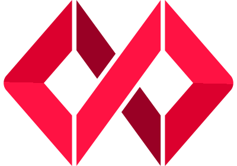

<!-- PROJECT LOGO -->
<br />
<div align="center">
  <a href="https://github.com/othneildrew/Best-README-Template">
   
  </a>

  <h1 align="center">Fusion Project Portal</h1>

  <p align="center">
    This projects documentation and specification can be found here 
    <br />
    <a href="https://equinor.github.io/fusion-project-portal/"><strong>Explore the docs</strong></a>
    <br />
  </p>
</div>

## About The Project

This projects main goal is to give the user a space serving workflows according to project phase and context. This will be served to the user in the form of a project portal. The portal will contain sections each containing specific application support the current phase. 

## Built With

This section should list any major frameworks/libraries used to bootstrap your project. Leave any add-ons/plugins for the acknowledgements section. Here are a few examples.

 [![typescript][Typescript]][Typescript-url]
 [![React][React.js]][React-url]
 [![Vite][Vite.js]][ViteJs-url]

## Getting Started

This is an example of how you may give instructions on setting up your project locally.
To get a local copy up and running follow these simple example steps.


### Installation


1. Clone the repo
```sh
   git clone https://github.com/equinor/fusion-project-portal.git
```
2. Open client folder
```sh
   $ cd client
```
3. Install dependencies
```sh
   yarn install
```
4. Run in development
```sh
   nx serve
```


[React.js]: https://img.shields.io/badge/React-20232A?style=for-the-badge&logo=react&logoColor=61DAFB
[React-url]: https://reactjs.org/
[Vite.js]: https://img.shields.io/badge/vite-20232A?style=for-the-badge&logo=vite&logoColor=61DAFB
[ViteJs-url]: https://vitejs.dev/
[Typescript]: https://img.shields.io/badge/typescript-20232A?style=for-the-badge&logo=typescript&logoColor=61DAFB
[Typescript-url]: https://typescriptlang.org
