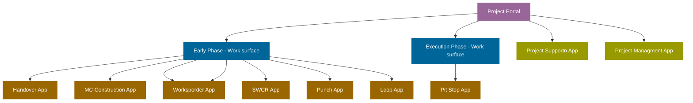
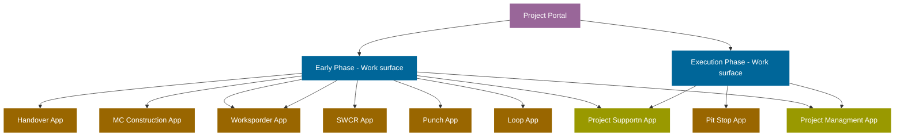
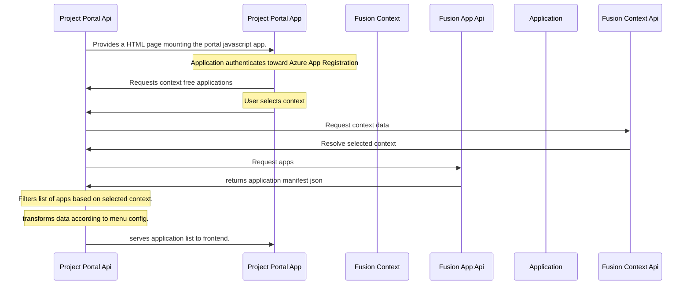

## 1. Introduction

This projects main goal is to give the user a space serving workflows according to project phase and context. This will be served to the user in the form of a project portal. The portal will contain sections each containing specific application support the current phase.

::: warning This document
This page should never considered project documentation under penalty of quickly becoming obsolete and unmaintainable. This is merely a study of what the project may or may not produce. At the left in the menu you will find the documentation.
:::

## 2. Further study

::: info
The table underneath should reflect subjects we need to further study and external dependencies
:::

### 2.1 Points subject to further study

| Devops ID | Title | Detail | Status | Subject holder |
| --------- | ----- | ------ | ------ | -------------- |
| ..        | ..    | ..     | ..     | ..             |

### 2.2 External dependencies

| Devops ID | Title              | Detail                                                                                       | Status   | Subject holder   | External Subject Holder |
| --------- | ------------------ | -------------------------------------------------------------------------------------------- | -------- | ---------------- | ----------------------- |
| NaN       | Widget             | The portal need some sort of widget support, a way to load a small to large javascript file. | planning | Christopher Hove | Terje Brådland          |
| NaN       | Application loader | Loading an application is core functionality and is essential for any further development.   | planning | Christopher Hove | Odin Thomas Rockman     |
| NaN       | Bookmarks          | For easy access all application need to be able to save bookmarks                            | planning | Gustav           | Odin Thomas Rockman     |

<!-- ## Assumptions -->

## 3. General context

As described in introduction of this page, this projects main goal is to give the user a space serving workflows according to project phase and context. So let s take closer look that tis means and how to structure is together.

### 3.1. Objectives

The portal is the main application shell, the portal core will be powered by Fusion Framework, a module provider serving the basic needs to make a portal. The portal fil consist of work selections, described as "work surfaces" before. There will represent one or more stages in the projects lifecycle.

#### 3.1.1 Context

By integrating with Fusion, context is key, almost all applications a driven by context. The portal must support context selection and apps should be provided accordingly. To prevent apps not showing good enough data the projects need to be onboard on to each context.

#### 3.1.2 Administration

To be able tho support this context driven portal, an administration surface will be needed. This application will lett an administrator create work surfaces, and edit them with ease. Changing Name adding a work surface description and more.

To be able on onboard a project the administrator needs to select the project / context and click on the apps that are ready for onboarding. The project administrator should then be promoted with a dialog explaining in detail the requirement nesear to keep data integrity to the point, and ensuring that all requirement are met.

#### 3.1.3 Supported phase's

“Project portal” will consist of different "work surfaces" , theses include `early-phase` and `execution-phase` in the beginning. More work surfaces may come in the future. There will eb the need for apps that span in the portal scope. of maybe the apps should be available in all works surfaces?

> Portal structure v1



> Portal structure v2



::: warning The Examples  
The above examples are only concepts sketches and should not be considered final structure architecture
:::

### 3.2 Existing

At this point there is a proof of concept portal that can be found at `jc.fusion.equinor.com` this portal is context bound to `Johand Castberg` and supports only the execution phase done by Construction and Commissioning, or CC for short.

#### 3.2.1 Fusion Apps

There are several apps in Fusion to day that support upon the execution phase. These apps have been recreated in the `Johan Castberg Project`. Apps available in the project portal will be based on the apps developed in that project. For `early-pase` apps are to be found in the current fusion portal and no changes will be made to the apps unless needed.

#### 3.2.2 JC apps based on Fusion Apps

CC-apps and CC-related components and utilities to migrate to the next version are the following.

CC Apps consist of:

- Workorder
- Handover
- Mechanical Completion
- SWCR
- Loop
- Punch
- PowerBI (Work preparation, Installation, Preservation, Checklist, Invitation for punch out, Commissioning procedure)

#### 3.2.3 New Applications

New CC-apps are.

- Scope Change
- Piping and Heat trace
- Release control

## 5. Constraints

One thing that may be considered a constraint may be; the old applications in fusion will not be supported in the new project portal. The reason behind this is that the new portal will not be introducing legacy fusion code and will have an new way of loading / instantiation of apps. This will require some work for the Fusion core team and all teams maintaining fusion apps, if the app is requested to be apart of the new project portal. Tha changes purposed this flow will increase scalability drastically, and allow for more diverse app development.

## 5. Requirements

### 5.1. Portal Service

The Razor page will serve static html and handle base routing, some routes need reverse proxy to avoid core issues when retrieving static assets. For now there only two main routes that will need reverse proxy there include; person photo and application assets. Fusion to day gets this form.



The above sequence diagram is an example of user flow when entering the project portal.

### 5.2 Assets reverse proxy

The portal will need to acquire assets from external dns's and will hence require reverse proxy to this restores to prevent core issues.

::: info
For more information and further research have a look at the swagger definition.

[https://pro-s-portal-ci.azurewebsites.net/swagger/index.html](https://pro-s-portal-ci.azurewebsites.net/swagger/index.html)
:::

```TS
// Photo
"https://fusion.equinor.com/images/profiles/**userId**"
Reverse Proxy To
"https://pro-s-people-fprd.azurewebsites.net/persons/**userId**/photo"
```

```TS
// Application assets
"https://fusion.equinor.com/bundles/apps/**appId**.js"
Reverse Proxy To
"https://pro-s-portal-fprd.azurewebsites.net/bundles/apps/**appId**.js"
```

When entering a Work surface the url should stay as root url. project-portal.equinor.com The next time the user is visited the site the user wil be directed to the last visited work surface.

<!--
## Portal Administration

Under portal administration one should be able to create works surface. some associated information for surface configuration should be able to provide here.

```csharp

public class WorksSurface
{
    public Guid  WorksSurfaceId { get; set; }
    public string Title { get; set; }
    public DateTime ReleaseDate { get; set; }
    public string Description { get; set; }
    public string Icon { get; set; }
    public WorksSurfaceConfig config {get; set; }
    public AppManifest[] apps { get; set; } // maybe find a new name for this.
    public string[] contextTypes { get; set; } // Need some input ;)
}

```


 -->
